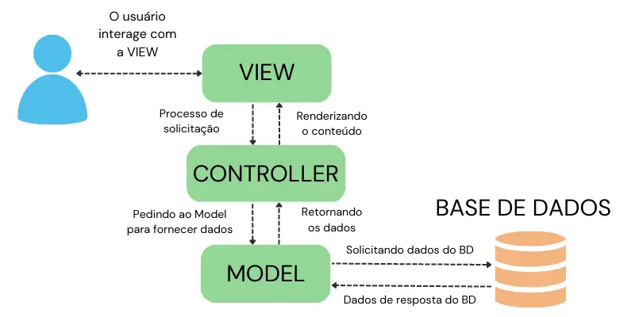

# Arquitetura MVC

Um estudo voltado para o padrão de arquitetura MVC em Python. 

Professor Rafael Ferreira - Programador Lhama

 

### Entendendo a pasta Main
A pasta _Main_ atua como o orquestrador do projeto, 
ou seja, ela atribui as funções devidas as camadas de Model, View e Controller, garantindo que as mesmas estejam devidamente conectadas.

### Entendendo a pasta Views
As views são responsáveis pela troca de informação com o usuário, nelas não há lógica.